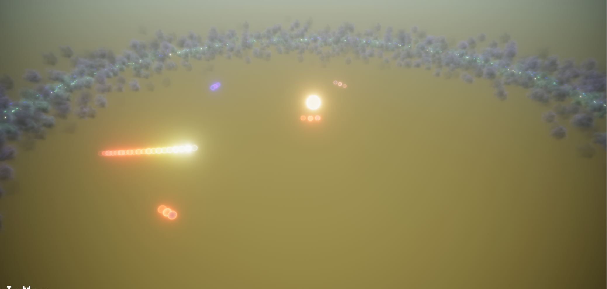
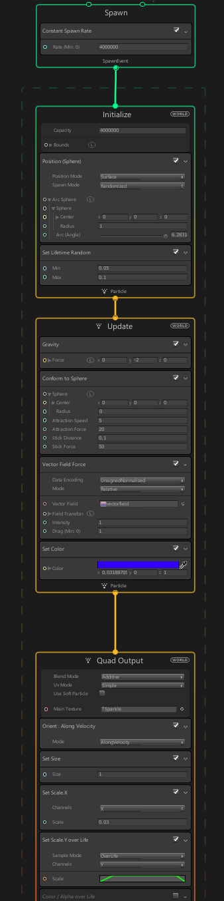

# Exploration Gaming Tech Demo
Visual Effects Graph

This is a project created using the new Unity technology called the Visual Effects Graph. As a group project, we worked to understand the tool and create a workable demonstration to show the functionality of it. For this project I worked on the orbiting planets and the code that displays the particles. The menu designs and other parts were created by William Bennett.

The tool that this project explores is a new particle effects tool that Unity has released within the last few months. While it is still in an experimental phase, the Visual Effects Graph proves very useful as it can display many more particles in a single effect than Unity's older systems. Using the graphics card to process particles instead of the processor, many more particles can be created per effect (our maximum was about 15,000,000 per effect). A slight drawback is that the particles used in this system cannot interract with Unity's current underlying physics system because of its reliance on the processor while the particles are rendered on the graphics card, but these problems are being addressed. The new Visual Effects Graph provides some exciting new developments and opportunities for great visual effects in the future

Image of the Demo Solar System:

Image of the node-based code that produces the planet's effects:

