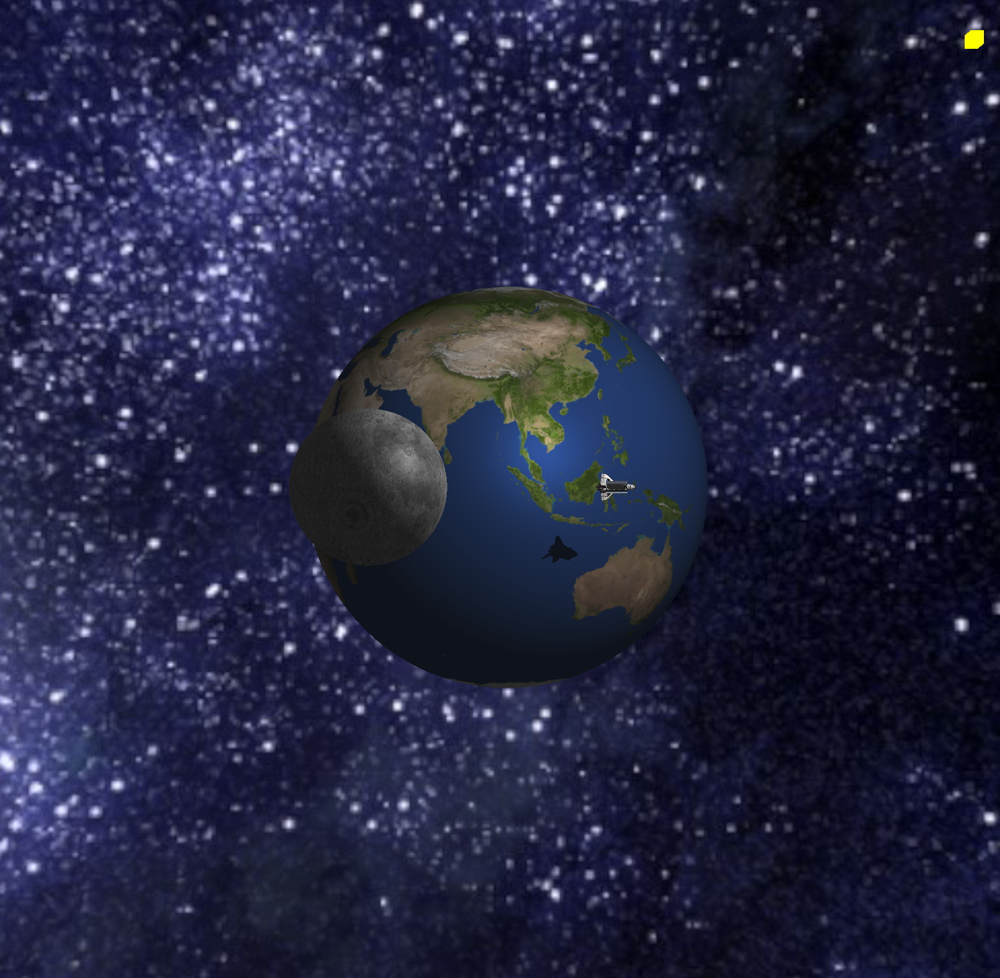

# Intro to Computing Graphics Final Project
Included here is the final project I created for Intro to Computing Graphics. It was programmed entirely in OpenGL using JOGL, the Java OpenGL library. This essentially translates from java to the native C++ code used to run OpenGL. While I did not actually use C++ to program this project it includes all of the same steps that would go into creating a normal OpenGL programming including allocating memory for buffers, creating shaders, and more.

