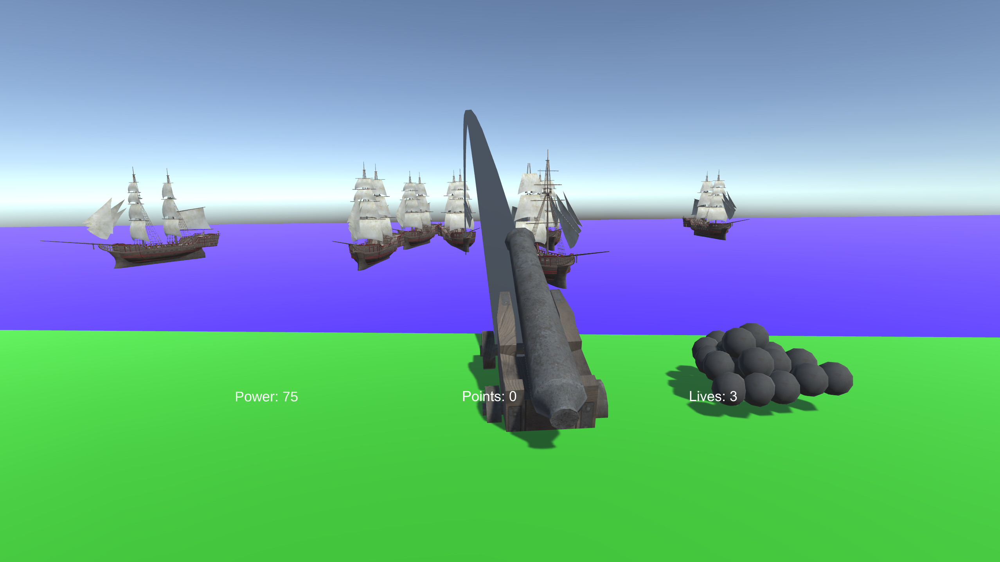

# Intro to Game Programming Project
The Guns of Navarrone

In this game the player controlls a cannon which fires at approaching ships. Score is kept as the player sinks ships and in stored in a high scores table. Created in Unity, it uses C# scripts for all the control of the game. In this project I designed and created all of the functionality. Overall I see this project as less about this game as a standalone and more about the mechanics of firing and tracking shots at approaching distant enemies.

